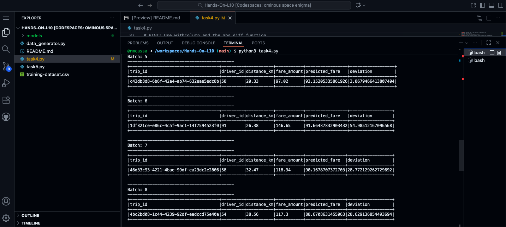

# Handson-L10-Spark-Streaming-MachineLearning-MLlib

## Task 4
We utilized sparkml in order to first train a linear regression model on static data (training-dataset.csv). Then, store and later utilize this model in order to do live predictions on streaming data. The streamed data from data_generator.py gives us data in real time that conatins time markers in order to allow us to use spark streaming. We stream this data and then give a prediction for the fare based on the trip's distance. We then calculate the deviation between the actual fare and the predicted fare. 

You can see this in the screenshot below of my output:

## Task 5
Task 5 has a very similar set to task 4, using the same static dataset and streamed data. The difference being that we batch our dataset/predictions into 5 minute windows. Using this batching may give us room to use more samples per prediction, possibly allowing more accurate predictions. So, the main difference is that we are predicting the average fare for the next 5 minutes instead of for each trip. 

You can see output in this screenshot below:

